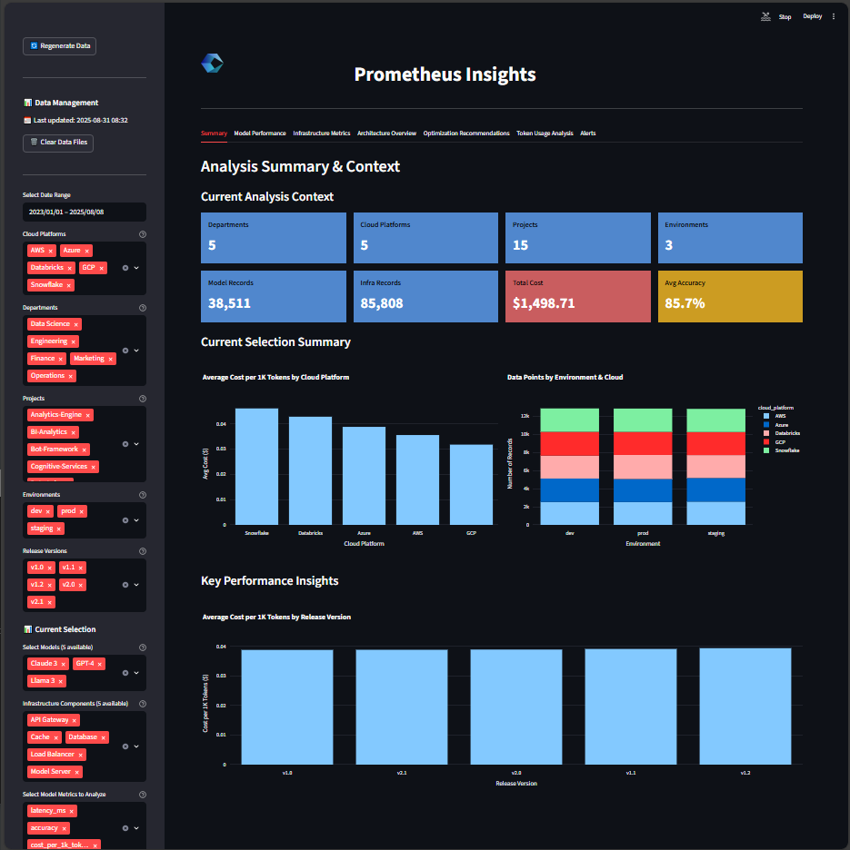

# USGS Earthquake Map
## Purpose
- created for Cognizant Vibe Coding Week 2025 (July 30 - August 6)
- Here are some milestones with this project:
  - 1st time trying out VSCode with the Gemini plugin
  - 1st Express app
  - 2nd MapBox integration in my own project
## Screenshot

## How to Build
```
git clone https://github.com/brianjester/myExpressApp.git
cd myExpressApp 
npm install
```
## How to Run
```
cd myExpressApp
npm start
```
In a browser visit: http://localhost:3000